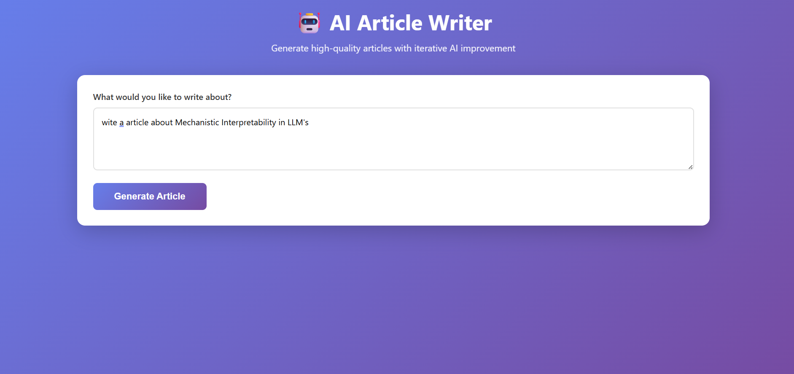
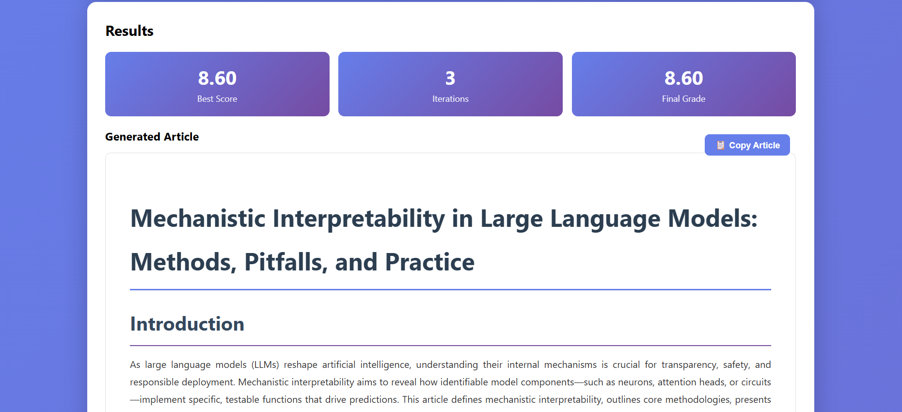

# 🤖 AI Article Writer - LangGraph Multi-Agent System

An intelligent article writing system that uses **LangGraph** to orchestrate multiple AI agents in an iterative workflow. The system writes, grades, improves, and refines articles until they meet professional editorial standards.






## 🎥 Demo Video
[Click here to watch the demo](https://github.com/user-attachments/assets/e1e54c2c-ede0-46aa-9074-02f6189d7bbb)


## 📖 Table of Contents

- [Overview](#overview)
- [System Architecture](#system-architecture)
- [How It Works](#how-it-works)
- [Project Structure](#project-structure)
- [Setup & Installation](#setup--installation)
- [Code Walkthrough](#code-walkthrough)


---

## 🎯 Overview

This project implements a **multi-agent workflow** using LangGraph to create high-quality articles through an iterative improvement process. The system consists of four specialized AI agents:

1. **Writer Agent** - Creates the initial article
2. **Grader Agent** - Evaluates article quality (0-10 scale)
3. **Suggestion Provider Agent** - Identifies improvements
4. **Changer Agent** - Applies improvements to the article

The workflow continues iterating until the article scores ≥8.0 or reaches 3 iterations, tracking the best article produced throughout the process.

---

## 🏗️ System Architecture

```
┌─────────────────────────────────────────────────────────────┐
│                      FastAPI Backend                         │
│  ┌────────────────────────────────────────────────────┐     │
│  │            LangGraph Workflow                       │     │
│  │                                                     │     │
│  │  START → Writer → Grader → [Decision Router]      │     │
│  │                      ↑              ↓              │     │
│  │                      │         Grade ≥ 8?         │     │
│  │                      │         Iterations ≥ 3?    │     │
│  │                      │              ↓              │     │
│  │                      │         No   │   Yes       │     │
│  │                      │              ↓      ↓       │     │
│  │                Changer ← Suggestion → END         │     │
│  │                             Provider               │     │
│  └────────────────────────────────────────────────────┘     │
└─────────────────────────────────────────────────────────────┘
                              ↕
                    REST API (JSON)
                              ↕
┌─────────────────────────────────────────────────────────────┐
│                    Frontend (HTML/JS)                        │
│              User Query → Display Results                    │
└─────────────────────────────────────────────────────────────┘
```

---

## 🔄 How It Works

### **Phase 1: Initial Writing**
```python
# nodes.py - writer function
def writer(state: State) -> State:
    messages = [
        SystemMessage(content=writer_prompt),
        HumanMessage(content=state["user_query"]),
    ]
    llm_response = writerllm.invoke(messages)
    return {"article": llm_response.content, ...}
```
The **Writer Agent** takes the user's query and generates a complete article following professional writing standards.

### **Phase 2: Quality Evaluation**
```python
# nodes.py - grader function
def grader(state: State) -> State:
    structured_grader_llm = graderllm.with_structured_output(GraderOutput)
    result: GraderOutput = structured_grader_llm.invoke(messages)
    
    # Track best article across iterations
    if grade_f >= best_score:
        best_score = grade_f
        best_article = state["article"]
```
The **Grader Agent** evaluates the article using structured output (JSON) with a grade (0-10) and detailed justification. It tracks the best article throughout iterations.

### **Phase 3: Conditional Routing**
```python
# nodes.py - routerfunction
def routerfunction(state: State) -> str:
    if state["grade"] >= 8 or state["iterations"] >= 3:
        return "end"
    else:
        return "suggestion_provider"
```
The **Router** decides whether to end (if grade ≥ 8 or 3 iterations reached) or continue improving.

### **Phase 4: Improvement Cycle** (if needed)
```python
# nodes.py - suggestion_provider and changer
def suggestion_provider(state: State) -> State:
    # Analyzes weaknesses and suggests specific improvements
    messages = [
        SystemMessage(content=suggestion_provider_prompt),
        HumanMessage(content=f"Article: {state['article']}\n Justification: {state['justification']}")
    ]
    # Returns concrete, actionable suggestions
    
def changer(state: State) -> State:
    # Applies suggestions to produce improved article
    messages = [
        SystemMessage(content=changer_prompt),
        HumanMessage(content=f"Article: {state['article']}\n Suggested Edits: {state['suggested_edits']}")
    ]
    # Returns polished, publication-ready article
```
The **Suggestion Provider** identifies specific improvements, and the **Changer** applies them to create a refined version.

---

## 📁 Project Structure

```
project/
│
├── backend/
│   ├── __init__.py
│   │
│   ├── api/
│   │   ├── __init__.py
│   │   └── main.py                    # FastAPI application with endpoints
│   │
│   ├── my_agents/
│   │   ├── __init__.py
│   │   ├── agents.py                  # LangGraph workflow definition
│   │   │
│   │   └── utils/
│   │       ├── __init__.py
│   │       ├── state.py               # TypedDict state definition
│   │       ├── nodes.py               # Agent node functions
│   │       └── prompts.py             # System prompts for each agent
│   │
│   └── services/
│       ├── __init__.py
│       └── langgraph_services.py      # Workflow orchestration service
│
├── frontend/
│   └── index.html                     # Web interface for testing
│
├── .env                               # Environment variables (API keys)
├── requirements.txt                   # Python dependencies
└── README.md                          # This file
```

---

## 🚀 Setup & Installation

### **Prerequisites**
- Python 3.11+
- OpenAI API key
- pip or conda

### **Step 1: Clone and Navigate**
```bash
cd your-project-directory
```

### **Step 2: Create `__init__.py` files**
```bash
# Make Python recognize directories as packages
touch backend/__init__.py
touch backend/api/__init__.py
touch backend/my_agents/__init__.py
touch backend/my_agents/utils/__init__.py
touch backend/services/__init__.py
```

### **Step 3: Install Dependencies**
```bash
pip install -r requirements.txt
```

**Key dependencies:**
- `fastapi` - Web framework
- `uvicorn` - ASGI server
- `langgraph` - Graph-based workflow orchestration
- `langchain-openai` - OpenAI integration
- `pydantic` - Data validation

### **Step 4: Configure Environment**
Create a `.env` file in the root directory:
```env
OPENAI_API_KEY=sk-your-openai-api-key-here
```

### **Step 5: Run the Server**
```bash
# From the project root directory
uvicorn backend.api.main:app --reload --host 0.0.0.0 --port 8000
```

The API will be available at:
- 🌐 **API Base**: http://localhost:8000
- 📚 **Interactive Docs**: http://localhost:8000/docs
- 📖 **ReDoc**: http://localhost:8000/redoc

---


## 🔍 Code Walkthrough

### **1. State Management (`state.py`)**
```python
class State(TypedDict):
    user_query: str              # Original user request
    article: str                 # Current article version
    grade: int                   # Current grade
    best_score: float            # Highest grade achieved
    best_article: str            # Best version of article
    justification: str           # Grader's feedback
    suggested_edits: str         # Improvement suggestions
    iterations: int              # Loop counter
    messages: Annotated[List, add_messages]  # Conversation history
```

**Purpose**: TypedDict ensures type safety and defines all data that flows through the workflow.

### **2. Workflow Graph (`agents.py`)**
```python
from langgraph.graph import StateGraph, START, END

graph = StateGraph(State)

# Add nodes (agents)
graph.add_node(writer, "writer")
graph.add_node(grader, "grader")
graph.add_node(suggestion_provider, "suggestion_provider")
graph.add_node(changer, "changer")

# Define edges (flow)
graph.add_edge(START, "writer")
graph.add_edge("writer", "grader")

# Conditional routing based on grade
graph.add_conditional_edges(
    "grader", 
    routerfunction, 
    {"suggestion_provider": "suggestion_provider", "end": END}
)

# Improvement loop
graph.add_edge("suggestion_provider", "changer")
graph.add_edge("changer", "grader")  # Back to grader

workflow = graph.compile()
```

**Key Concept**: LangGraph allows you to define complex AI workflows as directed graphs where:
- **Nodes** = Agent functions
- **Edges** = Flow between agents
- **Conditional Edges** = Decision points (like if/else)

### **3. Structured Output (`nodes.py`)**
```python
class GraderOutput(TypedDict):
    grade: float
    justification: str

structured_grader_llm = graderllm.with_structured_output(GraderOutput)
result: GraderOutput = structured_grader_llm.invoke(messages)
```

**Why?** Structured output ensures the LLM returns valid JSON that matches our schema, making the response reliable and parseable.

### **4. Best Article Tracking (`nodes.py`)**
```python
def grader(state: State) -> State:
    grade_f = float(result["grade"])
    best_article = state["best_article"]
    best_score = state["best_score"]
    
    # Update best if current is better or equal
    if grade_f >= best_score:
        best_score = grade_f
        best_article = state["article"]
    
    return {
        "best_score": best_score,
        "best_article": best_article,
        ...
    }
```

**Why?** Sometimes later iterations might score lower due to overediting. We preserve the best version across all attempts.

### **5. FastAPI Integration (`main.py`)**
```python
@app.post("/api/generate-article", response_model=ArticleResponse)
async def generate_article(request: ArticleRequest):
    try:
        # Run LangGraph workflow
        result_state = run_workflow(request.user_query)
        
        return ArticleResponse(
            success=True,
            best_article=result_state["best_article"],
            best_score=result_state["best_score"],
            ...
        )
    except Exception as e:
        raise HTTPException(status_code=500, detail=str(e))
```

**Key Features:**
- Pydantic models for request/response validation
- Proper error handling
- CORS enabled for frontend integration
- Automatic OpenAPI documentation

### **6. Prompts (`prompts.py`)**

Each agent has a specialized system prompt:

**Writer Prompt:**
```python
writer_prompt = """
You are a senior professional content writer...
Your task is to write a complete article that follows industry best practices...
Rules:
- Do NOT include meta commentary
- Write in a confident, authoritative tone
- The article should feel ready for publication
"""
```

**Grader Prompt:**
```python
grader_prompt = """
You are a senior editorial reviewer...
Evaluate the article on:
1. Clarity and coherence
2. Structure and logical flow
3. Depth and completeness
...
Rules:
- You must be strict and objective
- A score above 9.5 should be rare
- Respond ONLY in valid JSON
"""
```

These prompts define agent behavior and ensure consistent, high-quality outputs.

---


